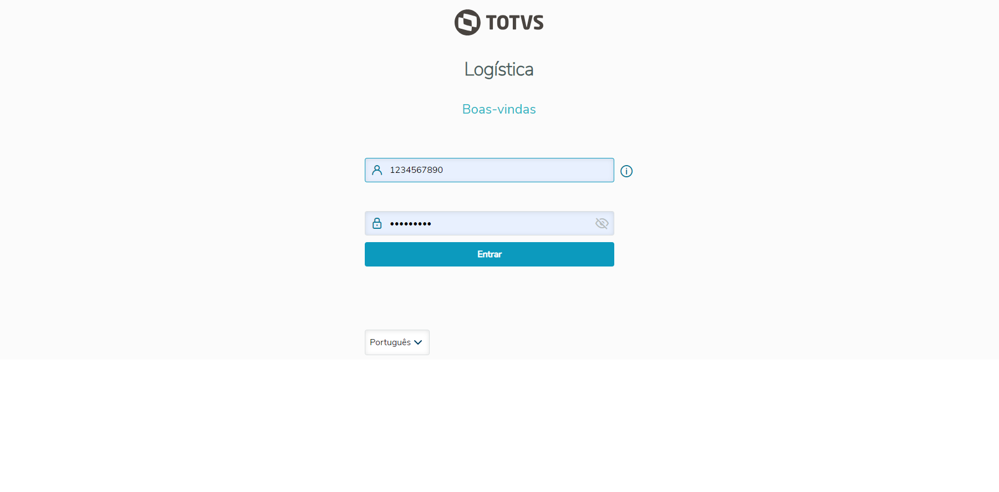
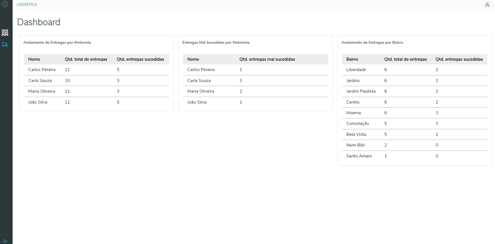
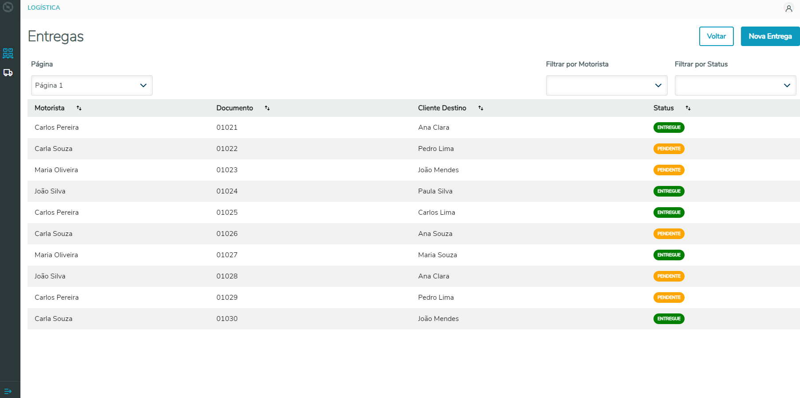
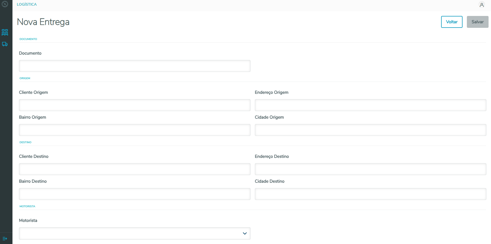

# Desafio Front-end - Logística com gerenciamento de transporte 

# Instalação
No ambiente da TOTVS:

1.	Clonar rep
2.	npm i
3.	ng serve

# Acessar Aplicação
Após rodar o comando 'ng serve':

1.	Acessar http://localhost:4200
2.	login: 1234567890 senha:Totvs@123

# Teste Unitário
ng test --code-coverage

# Imagens
## Login

## Dashboard

## Entregas

## Nova Entrega

